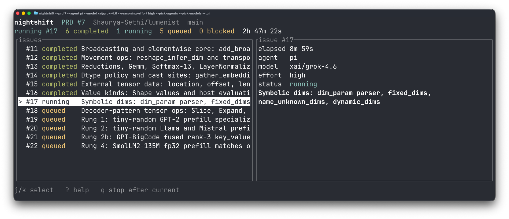

# nightshift

[](https://github.com/Shaurya-Sethi/nightshift/actions/workflows/ci.yml) [](https://crates.io/crates/nightshift-cli) [](LICENSE) [](https://www.rust-lang.org)

<p align="center">
  
</p>

Go to sleep with a backlog and wake up with merged PRs.

nightshift autonomously works through your GitHub issues while you are afk. Point it at a PRD (a Product Requirements Document, or spec, published as a GitHub issue), pick your [favourite coding agent](#supported-agents), and it handles the rest: branch, implement, PR, merge, repeat. It stops when every child issue is done. Inspired by the [Ralph Wiggum](https://ghuntley.com/loop/) loop pattern.

> [!WARNING]
> **nightshift selects work from native GitHub relationships, not issue-body text.** Child issues must be sub-issues of the PRD (`gh issue create --parent`), declare dependencies with `--blocked-by`, and carry the `ready-for-agent` label. Bodies are not parsed for membership or ordering. The bundled [skills](#skills) produce exactly this shape.

## Prerequisites

- **Rust + Cargo**: [install via rustup](https://rustup.rs)
- **Git**
- **GitHub CLI (`gh`) >= 2.94.0**: [install gh](https://cli.github.com), then run `gh auth login`. nightshift uses this to read native issue relationships (`parent`, `blockedBy`) and find your repository.
- **A coding agent**: install and sign in to whichever agent you pass to `--agent`. You only need one. See [Supported Agents](#supported-agents).

## Installation

```bash
cargo install nightshift-cli
```

The crate is published as `nightshift-cli`; the installed command is `nightshift`. This places the `nightshift` binary in `~/.cargo/bin`, which is on your `$PATH` after a standard Rust install.

For the latest unreleased code:

```bash
cargo install --git https://github.com/Shaurya-Sethi/nightshift
```

## Usage

```bash
nightshift --prd 12 --agent claude --model claude-opus-5
nightshift --prd 12 --agent claude --tui
```


| Flag                  | Required | Default                   | Description                                                                                          |
| --------------------- | -------- | ------------------------- | ---------------------------------------------------------------------------------------------------- |
| `--prd`               | yes      | n/a                       | The PRD issue number to work through                                                                 |
| `--agent`             | yes      | n/a                       | Whole-run default agent: `claude`, `codex`, `antigravity`, `cursor`, `pi`, `opencode`, `copilot`. `--pick-agents` may override per issue. |
| `--model`             |          | agent's persisted default | Whole-run model for agents that support non-interactive model selection                              |
| `--reasoning-effort`  |          | agent's persisted default | Whole-run agent-native effort. Cursor uses a model slug instead.                                     |
| `--pick-agents`       |          | `false`                   | TTY-only: pick an agent per planned issue. May combine with either other pick flag.                  |
| `--pick-efforts`      |          | `false`                   | TTY-only: pick effort per planned issue. Mutually exclusive with `--pick-models`.                    |
| `--pick-models`       |          | `false`                   | TTY-only: pick model (and effort where supported) per planned issue.                                 |
| `--pick-prompts`      |          | `false`                   | TTY-only: optional prompt file and append/replace mode per planned issue. Blank path inherits run-wide. |
| `--issue`             |          | `0`                       | Skip issues below this number (useful when resuming)                                                 |
| `--repo`              |          | detected from `gh`        | Repository as `owner/name`                                                                           |
| `--base-branch`       |          | `main`                    | Branch to sync to before each issue                                                                  |
| `--prompt-file`       |          | built-in guidelines       | File that overrides built-in directives for every issue unless a `--pick-prompts` row supplies a file |
| `--append-prompt-file`|          | n/a                       | File appended to the resolved agent's built-in directives for every issue unless a `--pick-prompts` row supplies a file. Mutually exclusive with `--prompt-file`. |
| `--dry-run`           |          | `false`                   | Show planned order and first prompt without starting an agent; requested preflight still runs        |
| `--tui`               |          | `false`                   | Opt-in Watch Board. Requires stdin and stdout TTY; fails before GitHub or git work. While work is active, `q` / Ctrl-C stop after the current issue without killing the agent. Idle `q` / Ctrl-C / Enter dismisses. |

### Invocation profiles

An **invocation profile** is the agent, model, and reasoning effort used for one issue.

`--agent` is required and is the default for the whole run. Optional `--model` and `--reasoning-effort` apply to every issue unless a picker overrides them.

To choose per issue, add any of `--pick-agents`, `--pick-efforts`, `--pick-models`, or `--pick-prompts` (TTY only). `--pick-efforts` and `--pick-models` cannot be combined; the other pick flags stack with either. Enter keeps a default. `q` or Ctrl-C cancels the whole picker; a partial selection never starts a run.

Picker order, inheritance, dry-run, and agent-specific knobs: [Invocation profiles](docs/invocation-profiles.md).

## Supported Agents

nightshift hands your agent a single prompt per issue. These agents work out of the box:


| `--agent` value | Command run | Nightshift `--model` | Nightshift reasoning effort | Project |
| --------------- | ----------- | -------------------- | --------------------------- | ------- |
| `claude`        | `claude`    | yes                  | `--effort`: `low`, `medium`, `high`, `max` | [Anthropic Claude Code](https://docs.anthropic.com/en/docs/claude-code) |
| `codex`         | `codex`     | yes                  | `-c model_reasoning_effort=…`: `minimal`, `low`, `medium`, `high`, `xhigh` | [OpenAI Codex CLI](https://github.com/openai/codex) |
| `antigravity`   | `agy`       | no                   | no; explicit model or effort fails fast | [Google Antigravity CLI](https://antigravity.google/blog/introducing-google-antigravity-cli) |
| `cursor`        | `agent`     | yes                  | **Model-Encoded Effort**; no separate effort flag | [Cursor](https://cursor.com/cli) |
| `pi`            | `pi`        | yes                  | `--thinking`: `off`, `minimal`, `low`, `medium`, `high`, `xhigh`, `max` | [Pi](https://pi.dev/) |
| `opencode`      | `opencode`  | yes                  | `--variant`; preflight legend: `low`, `medium`, `high`, `xhigh`, `minimal`, `max`; whole-run variants pass through unchanged | [OpenCode](https://opencode.ai/docs/cli) (`--model` uses `provider/model`) |
| `copilot`       | `copilot`   | yes                  | `--reasoning-effort`: `none`, `minimal`, `low`, `medium`, `high`, `xhigh`, `max` | [GitHub Copilot CLI](https://docs.github.com/en/copilot/how-tos/copilot-cli/automate-copilot-cli/run-cli-programmatically) (requires auth/subscription; org policy must allow CLI automation) |


> [!IMPORTANT]
> **Cursor uses Model-Encoded Effort.** Use `--model` or Cursor's model-only `--pick-models` preflight to choose a model slug that already represents the desired effort. nightshift never adds `--reasoning-effort`, rewrites Cursor model strings, or injects effort syntax into a model value. Cursor is invoked as `agent`, not `cursor-agent`.

When `--model` is omitted, nightshift lets the selected agent use its persisted default model. When it is provided, nightshift passes it through unchanged for agents with a documented non-interactive model flag. If an agent does not support that flag, nightshift fails fast and tells you to retry without `--model`.

nightshift validates at the **capability level** only: whether the selected agent supports model or effort selection, and, except for OpenCode's pass-through variants, whether an effort is in nightshift's documented agent-native set. It does not scrape model catalogs, validate model names, rewrite model slugs, or enforce model-specific effort matrices. The selected agent remains responsible for accepting a model and any model-specific effort subset.

To add support for a new agent, see [CONTRIBUTING.md](CONTRIBUTING.md).

## How It Works

nightshift works through your PRD one issue at a time, stopping when there is nothing left to pick up.

Each iteration starts from a clean state: nightshift checks out and pulls your base branch, then fetches all open `ready-for-agent` issues from GitHub. It keeps issues whose native parent is your PRD, then picks the lowest-numbered one whose `blockedBy` issues are all closed. If nothing is unblocked, it stops.

For the selected issue, nightshift constructs a unified prompt and pipes it to the coding agent via `stdin`. For details on prompt structures, default instructions, custom directives, and how nightshift manages isolated session context, see the [Context Management & Session Lifecycle Guide](docs/context-management.md).

Without `--tui`, the terminal shows only nightshift's own output (issue blocks, git hygiene, completion). `--tui` replaces that with a full-screen Watch Board. Agent `stdout` and `stderr` are discarded in both modes; use the agent's own UI or history for session detail. On failure, nightshift reports the process exit status, not agent log text. While the board is active, `q` / Ctrl-C stop after the current issue without killing the agent.

Details: [Terminal output](docs/terminal-output.md).

After the agent exits, nightshift checks that the issue is actually closed on GitHub. If it is, the loop continues from step one. If not, nightshift stops and tells you; the agent may have exited cleanly but left the issue open, which usually means something needs your attention.

### Resuming after a failure

After fixing the reported problem, rerun the same command. Nightshift fetches the current open issues and blocker states again: closed work is skipped, an unfinished child is retried, and its dependents wait until it closes. An agent failure stops the whole run, including independent queued issues.

A failed completion check does not necessarily mean the agent's work failed. If the agent closed the issue before the GitHub check failed, the next run skips that issue and continues with the remaining work. Check GitHub before undoing completed work.

Keep the same `--issue` floor when retrying unfinished work; raising it past an open prerequisite does not unblock its dependents. Per-issue picker choices are run-ephemeral, so choose them again on restart.

## Skills

nightshift ships three agent skills under [`skills/`](skills/). They make it easy to publish a PRD, create child issues with the right parent and blocked-by links, and get a nightshift command that matches how you want to run.

| Skill | Description |
| ----- | ----------- |
| `to-nightshift-prd` | Turn the current conversation into a PRD and publish it as a GitHub issue. |
| `to-nightshift-issues` | Break a PRD into tracer-bullet sub-issues with `--parent`, `--blocked-by`, and `ready-for-agent` (or `ready-for-human`). Creates the labels if missing. |
| `recommend-nightshift-profiles` | Recommend invocation profiles for a PRD's planned order and emit a copy-ready `nightshift` command (advice only). |

Flow: plan with an agent (or otherwise) → `to-nightshift-prd` → `to-nightshift-issues` → `recommend-nightshift-profiles` (optional) → `nightshift --dry-run` → `nightshift`. The first two skills need an authenticated `gh`.

### Installing

Recommended (requires Node for `npx`):

```bash
npx skills add Shaurya-Sethi/nightshift
```

No Node? Clone this repo and copy `skills/` into your agent's skills directory.

## Keeping Your System Awake

For long-running PRD loops, see [docs/keep-alive.md](docs/keep-alive.md).

## Contributing

`nightshift` is under active development, and i'd love your help! Whether you are fixing a bug, adding support for a new coding agent, or proposing new features, all contributions are extremely welcome.

### How to get involved:

- **File an Issue:** If you find a bug, encounter unexpected behavior, or have an idea for a new feature - [Open an issue](https://github.com/Shaurya-Sethi/nightshift/issues) to start a discussion.
- **Add a New Agent:** Want to use `nightshift` with another coding assistant? Follow the step-by-step agent integration guide in [CONTRIBUTING.md](CONTRIBUTING.md#tier-1-adding-a-new-agent).
- **Propose Other Changes:** For parser, orchestrator, or CLI changes, please open an issue first so we can align on the design. Check out [CONTRIBUTING.md](CONTRIBUTING.md#tier-2-everything-else) for codebase style and testing guidelines.
